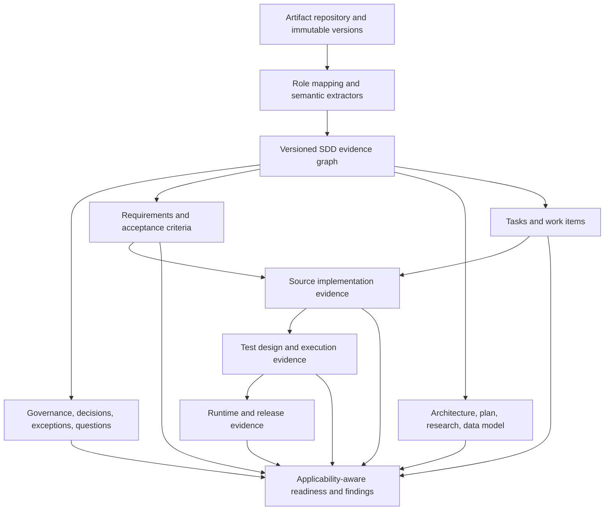

# SDD evidence and traceability architecture

## Purpose

Treat specification-driven development as a generic evidence workflow. Spec-Kit is one dialect. A workspace may be document-only, code-first, partial, multi-repository, or use different artifact names. No artifact is mandatory unless the selected project workflow says it applies.

## Target flow

## Architectural boundaries

### Artifact repository

Owns artifact bytes and provenance. An artifact record should have a stable ID, project/repository identity, semantic role, source path/name, content hash, loaded/modified timestamps, parser version, authority/lifecycle status, and immutable version identity. A baseline selects exact artifact versions. Replacing an artifact creates a new version and does not erase history.

### Dialect and role mapping

Map source formats into semantic roles such as Governance, Specification, Clarification, Decision, Architecture, Plan, Task, Research, DataModel, TestSpecification, ImplementationEvidence, and Other. A mapping records whether it came from explicit user configuration, metadata, a known filename convention, or content inference, with confidence. Spec-Kit maps `constitution`, `spec`, `plan`, `tasks`, `research`, and `data-model`; those names are not core requirements.

### Semantic extractors

Use one shared document parser/tokenizer where applicable, followed by focused extractors. Each extracted item retains exact artifact-version and section/line evidence. Extractors may produce partial results and diagnostics. A missing extractor or unknown syntax is `Unsupported`/`NotAssessed`, not a failed requirement.

### Evidence graph

Represent typed edges such as `governs`, `specifies`, `clarifies`, `decides`, `plans`, `tasks`, `implements`, `tests`, `verifies`, `supersedes`, and `references`. Each edge stores provenance, confidence (`Explicit`, `StronglySupported`, `Inferred`, `Unresolved`), source and target version identity, and validity interval/baseline. Filename similarity alone cannot create a confirmed implementation edge.

### Governance and authority

Keep authority separate from content and review state. Distinguish Draft, Baseline, Approved, Superseded, RejectedAlternative, Historical, and OpenQuestionSource. Decisions can explicitly resolve questions or supersede prior design. Exceptions have scope, rationale, evidence, approver, and optional expiry. Conflicts are classified as active, resolved, superseded, requiring clarification, or historical difference; old evidence stays visible without entering the current baseline.

### Requirements and acceptance criteria

Keep requirement ID as a source-preserved string; do not impose a global prefix regex. Store requirement type only when supported by evidence. Acceptance criteria are separately addressable children/references and may be missing, ambiguous, testable, or not testable. Link test design, test implementation, execution, and result separately.

### Plan, tasks, and research

Specification expresses need and outcomes; Plan expresses design/approach. Research records question, alternatives, sources, uncertainty, and recommendation but does not become an approved decision without an authority edge. Tasks carry documented status and links, but completion does not establish source implementation. Orphan and missing links are traceability gaps whose severity depends on lifecycle and applicability.

### Implementation and verification

Keep SourceDetected, Configured, RuntimeObserved, and assertion outcomes as distinct evidence layers. Source evidence can support `ImplementedWithEvidence`; it does not prove deployment or runtime. Test states distinguish Designed, Implemented, Executed, Passed, Failed, and Unknown. A runtime/release claim requires evidence from that layer.

## Readiness and invalidation

Readiness is a set of dimensions, not one completeness percentage: governance, requirements, clarifications, design, tasks, source implementation, tests, runtime/release, and traceability. Every dimension includes applicability and evidence state (`Ready`, `Partial`, `NeedsAttention`, `NotApplicable`, `NotAvailable`, `NotAssessed`). Findings are not equivalent to overall status or defects.

Derived results declare dependencies on exact artifact versions, source snapshots, and evidence edges. A changed Specification marks requirement extraction and dependent traceability stale; it does not clear unrelated source or environment analysis. Historical results remain available and are never rendered as current without matching their baseline fingerprints.

## Implemented lifecycle slice (2026-10-02)

The active workspace repository now captures a revision when an artifact role receives content with a new SHA-256 fingerprint. A revision keeps content, source reference, filename, capture time, role, explicit authority, revision number, and explicit supersession references. This history is serialized with the workspace through the `sdd_lifecycle_json` column and round-trips through autosave/restore. Authority remains independent from recency; new revisions begin `Unknown`, and a user explicitly chooses `Baseline`, `Approved`, `Draft`, or another supported state. Supersession is an explicit action, not inferred from time or filename.

The lifecycle JSON also carries clarification resolution/decision records, confidence/provenance/currentness links, implementation and test evidence records, requirement fingerprints/change observations, and review runs bound to Specification/Plan/Tasks fingerprints. The Implementation Evidence Review consumes the existing `ReviewContext`, records its document-derived links, and presents `Designed` separately from test execution. It no longer asks users to paste code or claims a review occurred when it did not. With no shared source-evidence adapter, source verification is expressly Not assessed.

Questions parsed from documents remain open even when the document contains answer text. A user action must provide both a resolution and an authoritative reference to resolve one. Requirement identity for change comparison uses explicit extracted IDs; text similarity does not merge requirements. A changed requirement/acceptance-scenario fingerprint makes associated evidence PotentiallyStale; a removed requirement moves evidence to Historical. Review runs remain stored and are shown as historical/stale if their source artifact fingerprints no longer match.

## Remaining implementation gaps

The lifecycle slice is persisted as versioned JSON attached to a workspace rather than a normalized evidence graph. It does not yet connect Source Analysis snapshots or persisted `CodeLink` records to requirements, and it does not persist one cross-role baseline manifest. Decision and exception editing, general conflict resolution, source-change invalidation, executed-test adapters, configurable artifact roles, and shared consumption from Quality/Requirements Traceability remain unimplemented. Treat those portions of the target flow above as remediation direction, not existing capability. The narrow custom-ID parser enhancement is implemented, but downstream models still have fixed artifact roles and some ID assumptions.
