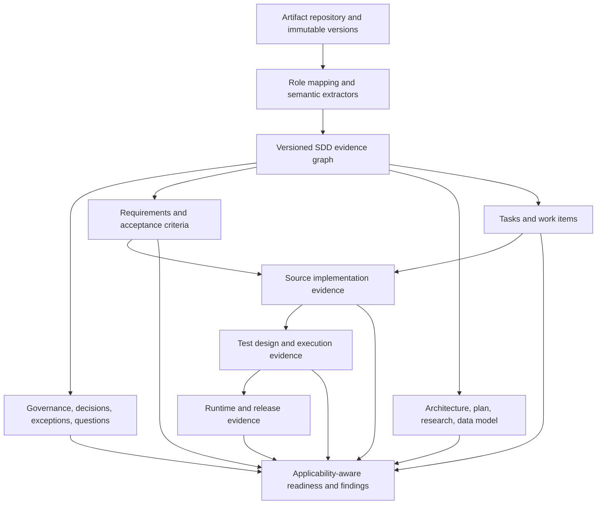

# SDD evidence and traceability architecture

## Purpose

Treat specification-driven development as a generic evidence workflow. Spec-Kit is one dialect. A workspace may be document-only, code-first, partial, multi-repository, or use different artifact names. No artifact is mandatory unless the selected project workflow says it applies.

## Target flow

## Architectural boundaries

### Artifact repository

Owns artifact bytes and provenance. An artifact record should have a stable ID, project/repository identity, semantic role, source path/name, content hash, loaded/modified timestamps, parser version, authority/lifecycle status, and immutable version identity. A baseline selects exact artifact versions. Replacing an artifact creates a new version and does not erase history.

### Dialect and role mapping

Map source formats into semantic roles such as Governance, Specification, Clarification, Decision, Architecture, Plan, Task, Research, DataModel, TestSpecification, ImplementationEvidence, and Other. A mapping records whether it came from explicit user configuration, metadata, a known filename convention, or content inference, with confidence. Spec-Kit maps `constitution`, `spec`, `plan`, `tasks`, `research`, and `data-model`; those names are not core requirements.

### Semantic extractors

Use one shared document parser/tokenizer where applicable, followed by focused extractors. Each extracted item retains exact artifact-version and section/line evidence. Extractors may produce partial results and diagnostics. A missing extractor or unknown syntax is `Unsupported`/`NotAssessed`, not a failed requirement.

### Evidence graph

Represent typed edges such as `governs`, `specifies`, `clarifies`, `decides`, `plans`, `tasks`, `implements`, `tests`, `verifies`, `supersedes`, and `references`. Each edge stores provenance, confidence (`Explicit`, `StronglySupported`, `Inferred`, `Unresolved`), source and target version identity, and validity interval/baseline. Filename similarity alone cannot create a confirmed implementation edge.

### Governance and authority

Keep authority separate from content and review state. Distinguish Draft, Baseline, Approved, Superseded, RejectedAlternative, Historical, and OpenQuestionSource. Decisions can explicitly resolve questions or supersede prior design. Exceptions have scope, rationale, evidence, approver, and optional expiry. Conflicts are classified as active, resolved, superseded, requiring clarification, or historical difference; old evidence stays visible without entering the current baseline.

### Requirements and acceptance criteria

Keep requirement ID as a source-preserved string; do not impose a global prefix regex. Store requirement type only when supported by evidence. Acceptance criteria are separately addressable children/references and may be missing, ambiguous, testable, or not testable. Link test design, test implementation, execution, and result separately.

### Plan, tasks, and research

Specification expresses need and outcomes; Plan expresses design/approach. Research records question, alternatives, sources, uncertainty, and recommendation but does not become an approved decision without an authority edge. Tasks carry documented status and links, but completion does not establish source implementation. Orphan and missing links are traceability gaps whose severity depends on lifecycle and applicability.

### Implementation and verification

Keep SourceDetected, Configured, RuntimeObserved, and assertion outcomes as distinct evidence layers. Source evidence can support `ImplementedWithEvidence`; it does not prove deployment or runtime. Test states distinguish Designed, Implemented, Executed, Passed, Failed, and Unknown. A runtime/release claim requires evidence from that layer.

## Readiness and invalidation

Readiness is a set of dimensions, not one completeness percentage: governance, requirements, clarifications, design, tasks, source implementation, tests, runtime/release, and traceability. Every dimension includes applicability and evidence state (`Ready`, `Partial`, `NeedsAttention`, `NotApplicable`, `NotAvailable`, `NotAssessed`). Findings are not equivalent to overall status or defects.

Derived results declare dependencies on exact artifact versions, source snapshots, and evidence edges. A changed Specification marks requirement extraction and dependent traceability stale; it does not clear unrelated source or environment analysis. Historical results remain available and are never rendered as current without matching their baseline fingerprints.

## Implemented lifecycle slice (2026-10-02)

The active workspace repository now captures a revision when an artifact role receives content with a new SHA-256 fingerprint. A revision keeps content, source reference, filename, capture time, role, explicit authority, revision number, and explicit supersession references. This history is serialized with the workspace through the `sdd_lifecycle_json` column and round-trips through autosave/restore. Authority remains independent from recency; new revisions begin `Unknown`, and a user explicitly chooses `Baseline`, `Approved`, `Draft`, or another supported state. Supersession is an explicit action, not inferred from time or filename.

The lifecycle JSON also carries clarification resolution/decision records, confidence/provenance/currentness links, implementation and test evidence records, requirement fingerprints/change observations, and review runs bound to artifact/source/evidence fingerprints. `SddEvidenceGraphService` is the shared projection consumed by Implementation Review, Requirements Traceability, and the SDD finding slice of Quality Review. It derives document-backed plan/task links once, retains explicit lifecycle links, and keeps implementation evidence, designed tests, and executed test evidence separate. Views do not independently parse source or infer links from wording.

Questions parsed from documents remain open even when the document contains answer text. A user action must provide both a resolution and an authoritative reference to resolve one. Requirement identity for change comparison uses explicit extracted IDs; text similarity does not merge requirements. A changed requirement/acceptance-scenario fingerprint makes associated evidence PotentiallyStale; a removed requirement moves evidence to Historical. Review runs remain stored and are shown as historical/stale if their source artifact fingerprints no longer match.

## Source Analysis and CodeLink adapter

Source Analysis remains the owner of source parsing and snapshot identity. The SDD adapter reads existing Source Analysis snapshots through the Integration Catalog API and persisted CodeLinks through a read-only Code Traceability projection. A lifecycle implementation evidence record binds to snapshot ID, archive SHA-256, analyzer version, analysis timestamp, evidence/link ID, file reference, confidence, and limitations. Only a CodeLink whose requirement scenario explicitly contains a current requirement ID is linked; filename or keyword similarity alone does not create a claim. The evidence states that its target validation is `NotAssessed`: the current Source Analysis projection does not retain a complete file/symbol inventory for deterministic target re-resolution. Partial analyzer status and limitations remain attached to snapshot references.

When a different source archive is selected, old source-backed evidence is retained and marked `PotentiallyStale` with a reason rather than deleted. Tests explicitly bound to a source snapshot are also marked potentially stale when its fingerprint differs; unbound executions are not invalidated. Exact CodeLink re-resolution and same-target currentness cannot yet be proved from the projection, so this path errs toward review rather than claiming the old evidence remains current. Unsupported/partial analysis limitations are surfaced separately from a missing requirement link. Graph synchronization is idempotent and does not silently reconfirm a stale relationship because a view was opened.

## Executed test evidence

`SddTestExecutionEvidence` is distinct from designed `SddTestEvidence`. A generic structured JSON import accepts explicit requirement and acceptance-criterion references and preserves provider/result source, execution state, result, timestamps, environment/build/source references, provider result ID, and fingerprint. Execution state and result are independent: for example, a completed failed test is `Completed/Failed`, while a provider failure is `ExecutionFailed/Unknown`. Imports are deduplicated by provider result ID or deterministic record fingerprint. Designed scenarios never become executed or passed automatically. Requirement/AC changes make linked execution evidence potentially stale while preserving the immutable old result.

No framework-specific JUnit, TRX, CI, or external test-management provider is implemented yet; the import record is the stable generic integration boundary. Runtime behavior is not inferred from test results.

## Shared graph consumers

Requirements Traceability is now a view over `SddEvidenceGraphService`, not its former independent traceability-analysis model. It separately presents current requirement/AC, plan, task, implementation, test-design, execution-state, result, and currentness dimensions, and shows unlinked task/source/test evidence as traceability gaps. Quality Review consumes deterministic findings from that same projection, including unresolved questions, missing current implementation/execution evidence (`NotAssessed`), and potentially stale evidence (`NeedsReview`). It persists a Quality Review run with the graph fingerprint so a later graph change makes the prior result historical. The graph does not turn missing evidence into a failure, and existing generic/non-SDD Review Pack rule evaluation remains intact.

## Remaining implementation gaps

The graph remains a versioned JSON document inside each workspace, not a normalized graph database. There is no complete source file/symbol inventory in the Source Analysis projection, so CodeLink targets cannot be re-resolved against a new snapshot. Test execution currently has only the generic structured import boundary; provider adapters and raw report retention are future work. Rich active-conflict resolution and exception approval workflows, richer/custom artifact-role mapping, cross-role baseline manifests, and external E2E/performance test providers remain incomplete. The current requirements extractor also limits how completely arbitrary acceptance-criterion IDs can be normalized. One important authority boundary remains: graph rows currently project the active shared `ReviewContext` selection and do not reconstruct a separate non-selected Baseline revision from its retained content. Authority metadata is explicit, but baseline-driven graph selection still needs implementation before the graph can claim it always represents authoritative intent. These limitations must remain explicit; no unavailable capability should be reported as a failed project requirement.
