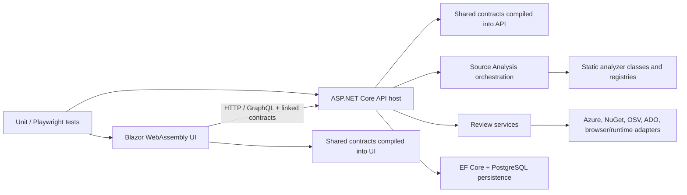

# BirkNext project and technology independence audit

Audit date: 2026-10-02
Starting HEAD: `dbaab53b3ef67f07db7b7f2ab8d4b455034af008`, branch `008-traceability-first`.
Scope note: the working tree already had staged Pipeline Review changes at audit start. They were treated as present for code inspection and were not modified. During the audit, that work advanced into branch history; the checkout at completion was `58db98e` (including merge `383d06a`). The audit document is the only audit-created file; no tests/builds were run because no executable code changed.

## Executive assessment

BirkNext can be used today for a non-M2LB project, including one that is not .NET or Azure, but its useful support depends on the review entry point. It is **not yet a project-agnostic, technology-extensible core**. It is a large ASP.NET Core/Blazor application that combines generic review contracts and several real provider boundaries with a substantial .NET/Azure implementation. Java/Kafka/AWS projects can use document/artifact workflows, browser/API runtime reviews, uploaded SBOM review, and portions of generic source evidence; they do not receive Java/Spring architecture semantics, full Maven dependency inventory, Kafka runtime evidence, or AWS environment analysis. A Java stack should often yield partial or undetected source analysis, not a complete architecture review.

The strongest generic foundations are the immutable Source Analysis snapshot/evidence envelope, per-domain support/completeness statuses, format-oriented contract evidence, neutral pipeline graph concepts, runtime HTTP/browser review, and interfaces around selected package/advisory/auth/cloud evidence providers. The weakest boundaries are the monolithic backend dependency graph, static analyzer registries, .NET-only architecture project model, .NET-oriented package inventory, Azure-specific integration/runtime models, and M2LB-bound seed/security/active-test workflows.

No production `if project == M2LB` branch was found in the inspected generic analyzers. There **is** intentional project-specific production behavior: `IntegrationCatalogService` attaches the M2LB DEV seed when a specific environment type and exact host match. This is a contained pilot seed, but it runs in a shared catalog service. Other M2LB names are concentrated in this seed, M2LB-oriented reviews, development settings, user guidance and fixtures. Several should be made opt-in or moved behind an explicitly named domain pack before claiming general-purpose onboarding.

## Repository and dependency architecture

The `AIAssisted` product has five .NET projects: one ASP.NET Core API, one Blazor WebAssembly UI, backend/frontend unit-test projects, and a Playwright test project. There is no independently built `BirkNext.Core`, analyzer package, provider package, or plugin assembly. The API project directly references Azure Identity, Event Hubs, Monitor Query, Blob Storage, Roslyn C#, Hot Chocolate, EF Core, Npgsql, Serilog, Playwright and other tool libraries (`backend/BirkNext.Api/BirkNext.Api.csproj`). The frontend directly references Blazor WebAssembly, StrawberryShake.Blazor and Markdig (`frontend/BirkNext.Web/BirkNext.Web.csproj`). The API tests also reference the Web project; Playwright tests reference both Web and API.

The shared contracts are source-linked into both API and UI project files rather than provided by a standalone versioned domain assembly. This avoids a runtime UI-to-provider dependency, but API and UI must compile the same shared source and enum changes are still a cross-cutting serialization concern. Architecture extractors are an internal static list (`SourceArchitectureAnalyzer.Extractors`); source-domain analyzers use an internal registry with a static `Default` list (`SourceEvidenceAnalyzerRegistry.Default`). Neither is a discoverable provider registry. Adding analyzers requires editing and testing core API code.

### Independence ratings

| Dimension | Rating | Evidence-based assessment |
|---|---|---|
| Project independence | **Adequate** | Generic archive, snapshots and manual/document workflows work without a project-name branch; default sample/onboarding and selected reviews are M2LB-specific. |
| Language independence | **Limited** | File inventory is broad, but semantic architecture is C#/.NET-only. Non-C# language support is mostly file/config/contract evidence. |
| Framework independence | **Limited** | Runtime browser/API review is mostly protocol-based; source framework detection is ASP.NET/Hot Chocolate/Wolverine-centric. |
| Cloud independence | **Weak** | Azure-specific services and packages share the API host; no AWS/GCP environment provider exists. IaC source categories are more neutral. |
| Database independence | **Limited** | EF Core and SQL DDL/migration extraction; PostgreSQL is BirkNext's own persistence provider. No document/key-value/graph database analyzers. |
| Messaging independence | **Limited** | Shared names include Kafka/RabbitMQ, but structured runtime/resource models and source semantic analyzers focus on Azure Event Hubs/Service Bus and Wolverine. |
| CI/CD independence | **Adequate** | Source evidence has Azure Pipelines, GitHub Actions, GitLab CI and Jenkins readers (all partial); pipeline graph/result concepts are neutral. Other platforms are not parsed. |
| Authentication independence | **Limited** | Generic HTTP auth options exist in some reviews; Azure Identity/Entra/Managed Identity and ADO PAT are operational providers. Security classification has a M2LB-specific identity pipeline. |
| Observability independence | **Limited** | Generic logs/metrics/traces/correlation evidence exists, but source heuristics and Azure Monitor/App Insights runtime ingestion are provider-specific. |
| Workflow independence | **Adequate** | Source-only, URL/API, uploaded-artifact and document workflows exist. Spec-Kit artifact chain and sample-project entry remain prominent; many review packs require particular evidence. |

## Generic core, coupling, and evidence semantics

There is no separate generic core assembly to certify as provider-independent. `SourceEvidenceDomainContracts.cs` is a notably good shared abstraction: domain, source snapshot/fingerprint, analyzer version, status, technologies, diagnostics, limitations, and capability support are separate fields. `Unsupported`, `NotDetected`, `Partial`, and `FailedAnalysis` are distinct; that is the right semantic basis for unsupported technologies not being treated as failed analysis. Infrastructure categories include provider-neutral concepts, and Source Analysis explicitly says project names are not analyzer rules.

Evidence maturity is not fully unified across the product. Source Analysis has its own evidence states, source snapshots have provenance, runtime reviews have their own `Available/Unavailable/NotAuthorized` states, and the recent Message Flow work adds `Documented`, `SourceConfirmed`, `Configured`, `AzureObserved`, and runtime/assertion states. The layers are improving but are parallel per feature; there is no single capability/provenance contract all reviews consume.

The analyzer registry is extensible only inside the API assembly. Source-evidence analyzer `Info` declares domain, technology, stage, dependencies and outputs and validates ordering/cycles. This is adequate modularity, not a plugin boundary. Architecture extractor `CanAnalyze` and `Analyze` similarly separate extractors from aggregation, but the list is static and the input aggregate is .NET-specific. Provider interfaces exist in select areas (package registry, advisory, dependency automation, authenticated review gateway, source evidence provider, active environment probes); other services instantiate static parser arrays or use switches.

### Dependency direction findings

- **High:** technology-specific packages are dependencies of the same API host that owns generic HTTP/API controllers, analyzers and review orchestration. This makes deployment/startup/package management and testing one combined surface even if feature visibility disables a review.
- **Medium:** API and UI compile linked copies of shared contracts, and there is no schema/version negotiation layer for persisted JSON enum values. Enum additions are usually appended carefully, but renames/removals and old persisted workspaces remain a compatibility risk.
- **Low/medium:** test projects have a reference direction that would be unusual for production architecture (backend tests reference Web; Playwright tests reference both). This is test harness coupling, not a runtime dependency.

## Capability and technology matrix

“Partial” means actual structured evidence exists but is heuristic, format-limited or not a framework-semantic analyzer. “Unsupported” means this audit found no semantic analyzer/provider; arbitrary files may still be retained or listed.

| Area | Generic abstraction | .NET | Java/Kotlin | Node/React | Python | Go | Other / coupling risk |
|---|---|---:|---:|---:|---:|---:|---|
| Architecture | Components, dependencies, APIs/channels/stores in output | **Supported, narrow**: `.csproj`, C# regex extractors | Unsupported | Unsupported semantically | Unsupported semantically | Unsupported | High .NET coupling in project/component discovery. |
| Database | Tables, columns, keys, relationships | **Partial**: EF Core + migrations | Unsupported | Unsupported | Unsupported | Unsupported | SQL DDL is parsed, dialect coverage not declared; Oracle/MySQL/Postgres genericity unproven; NoSQL unsupported. |
| Contracts | Format-tagged operations/types/elements and compatibility evidence | Partial C# message DTOs | No Spring contract semantics | Partial format evidence | No framework semantics | Partial protobuf format evidence | OpenAPI JSON **supported**, YAML partial; GraphQL supported; AsyncAPI/JSON Schema/XSD/Protobuf partial; WSDL/SOAP, Avro, CloudEvents not found. |
| Dependencies | SBOM and dependency graph contracts | NuGet inventory + SBOM | SBOM import; Maven/Gradle inventory unsupported | SBOM import; package.json inventory not established | SBOM import; Python inventory unsupported | SBOM import; go.mod inventory unsupported | Registry/advisory provider architecture exists, but configured registry provider is NuGet; Docker images supported. |
| CI/CD | Pipeline/job/stage/artifact/gate graph | Azure YAML partial, strongest | Unsupported | GitHub Actions partial | Unsupported | Unsupported | GitLab/Jenkins partial; CircleCI/Bitbucket unsupported. Staged Pipeline Review currently interprets this evidence; optional Azure DevOps metadata is provider-specific. |
| IaC | Provider-neutral resource categories and relations | Terraform/Bicep/ARM/K8s/Helm partial | N/A | N/A | N/A | N/A | Terraform is provider-neutral syntax; resource catalog has Azure-forward mappings; CloudFormation/Pulumi unsupported. |
| Observability | Logs, metrics, traces, correlation and findings | Partial source patterns | Unsupported | Unsupported | Unsupported | Unsupported | Runtime Azure Monitor/App Insights integration is provider-specific; no CloudWatch/Datadog/Prometheus backend provider found. |
| Security | Generic findings/expectations/readiness exist | ASP.NET/Entra adapters | Unsupported source semantics | Unsupported source semantics | Unsupported source semantics | Unsupported source semantics | Security Classification review is strongly M2LB child-domain-specific; OAuth/OIDC providers not generally interchangeable in all workflows. |
| Frontend | Browser URL/DOM/performance/accessibility/security review | Blazor-specific internal product and analyzers | N/A | Target browser checks work at URL/runtime; source semantics absent | N/A | N/A | Playwright/Lighthouse/axe/ZAP are reusable tools; deployment/browser prerequisites can make engines unavailable. |
| API | Protocol-aware REST/GraphQL models | ASP.NET/Hot Chocolate source detection | Runtime REST can work; source detection absent | Runtime REST can work; source detection absent | Runtime REST can work; source detection absent | Runtime REST can work; source detection absent | SOAP/gRPC/WebSocket review not shown as supported. GraphQL parser/model is generic with Hot Chocolate-specific technology detection. |
| Integration/message flow | Integration definitions and generic hop graph | Azure resource/runtime path richest | Manual/documented flow can work | Manual/documented flow can work | Manual/documented flow can work | Manual/documented flow can work | Kafka/RabbitMQ names in models do not imply equivalent runtime/test/provider support. |
| Cloud | Azure environment snapshot/comparison | **Azure-specific** | AWS/GCP not detected | AWS/GCP not detected | AWS/GCP not detected | AWS/GCP not detected | Azure feature is optional by settings/visibility but not isolated into a provider assembly. |

### Source Analysis language and build-format support

| Language or format | Actual observed support |
|---|---|
| C# | Architecture extraction via `.csproj` ownership and C# source regex scanners; some C# contract/message/observability/security evidence. This is not general Roslyn semantic analysis despite Roslyn being referenced. |
| Java/Kotlin | Unsupported for architecture semantics; `.java`, `pom.xml`, Gradle files are not project models in the audited architecture input. |
| JavaScript/TypeScript | Package/lock/config files may be classified or read as text; no React/Node architecture semantic extractor found. |
| Python | No Python project/build or architecture extractor found. |
| Go | No Go module or architecture extractor found. |
| Rust | No Cargo or architecture extractor found. |
| PHP, Ruby, C/C++ | No language project/architecture extractors found. |
| SQL | Partial DDL evidence; SQL is also categorized as source code in generic evidence file classification. |
| Generic text/config | Supported as bounded file/config evidence where recognized; unknown extension is not a semantic code analyzer. |
| .NET build | `.csproj` architecture; dependency inventory also reads central package props, global.json and dotnet tools. `sln` is recognized metadata but not a general build graph. |
| Java build | `pom.xml`, Gradle/settings files not parsed. |
| Node build | `package.json` and common lockfiles are classified, but full package graph and framework architecture support are not provided by these paths. |
| Python/Go/Rust build | `pyproject.toml`/requirements, `go.mod`, `Cargo.toml`/lock are not dependency inventory inputs found. |
| Containers/local orchestration | Dockerfile, Compose and .NET Aspire evidence exists; Compose/Aspire is explicitly local orchestration evidence, not deployed topology. |

Source Analysis does have robust multi-snapshot provenance and explicitly selected related repository scopes. The shared provider resolves exact IDs, groups repositories, records fingerprints and never substitutes “latest” for an unavailable selected snapshot. This is a generic strength. However, architecture component identification starts from .NET project files; a Java/Kotlin monorepo can be uploaded but cannot get equivalent component ownership or per-component technology capabilities today.

## Contracts, databases, infrastructure, pipelines, and messaging

### Contracts

The Source Analysis Contract analyzer has typed format branches: OpenAPI JSON is supported by an existing extractor; OpenAPI YAML/Swagger 2, AsyncAPI, JSON Schema, XSD and Protobuf are partial; GraphQL SDL/operations are parsed; C# message contract classes are discovered via the existing integration-path analyzer. XSD preserves namespace and structural evidence but does not compile schemas or fully expand referenced types. WSDL/SOAP, Avro, CloudEvents and gRPC contract analysis were not found. Contract evidence is not equivalent to runtime compatibility.

The runtime API Quality Review supports one REST service or GraphQL endpoint at a time, makes read-only requests, and records response structure rather than values. OpenAPI and GraphQL have separate extractors/rules. GraphQL parser is Hot Chocolate's parser; technology detection recognizes Hot Chocolate and Strawberry Shake, which is a useful distinction between generic GraphQL concepts and framework signals. Source endpoint/controller discovery, however, is ASP.NET-specific. SOAP is present as an IQR integration enum value, not proof of an SOAP analyzer.

### Databases

Database Architecture runs EF Core model, EF migration syntax and SQL DDL extractors. The result contract is provider-neutral (schemas/tables/columns/keys/relations/confidence), but input extraction is implementation-specific and the snapshot adds “EF Core” when it recognizes EF evidence. PostgreSQL is the API's own persistence provider. The audit found no MongoDB/Cosmos/DynamoDB/Cassandra/Redis/graph/document-store schema analyzer. Oracle is not independently proven by a SQL parser's presence. Do not force these stores into relational table semantics.

### Infrastructure/cloud

Source evidence has formats Terraform, Bicep, ARM, Kubernetes and Helm, neutral categories such as compute/database/messaging/storage/identity/networking, and cross-domain link evidence. Parsing is bounded and provider/resource mappings are catalog-driven. Kubernetes/K8s manifests can be represented without AKS as source evidence, but there is no complete Kubernetes object/cluster runtime provider established here. CloudFormation and Pulumi are absent. Azure Environment Analysis is an Azure-specific feature; its types and service are named accordingly and it can be feature-disabled, which is good product scoping. It is not package-isolated: Azure SDKs/configuration are in the main API project. Adding AWS/GCP environment inventory therefore requires provider interfaces/services plus core hosting/config/API/UI changes and a new evidence comparison model—not just dropping in an adapter.

### CI/CD and Pipeline Review

Source CI/CD evidence supports Azure Pipelines, GitHub Actions, GitLab CI and Jenkins by partial parsing. Azure Pipelines has the richest YAML/task mapping; GitHub/GitLab use a YAML subset and Jenkins is pattern-based, not Groovy evaluation. CircleCI, Bitbucket, Buildkite and generic arbitrary YAML are not supported. The staged Pipeline Review work reads normalized Source Analysis output and uses neutral concepts (pipeline, stage, job, artifact, environment, validation/gate edges); this is a solid consumer boundary. Its Azure DevOps metadata source is optional and does not supply runtime history. Adding GitHub workflow-run evidence would need an analogous provider; adding a new static platform currently means changing central analyzer technology detection, the platform enum/parser switch, tests, and potentially downstream switch-based interpretations.

### Messaging and IQR

IQR has a useful but closed `IntegrationType` enum (`REST`, `GraphQL`, `EventHub`, `ServiceBus`, `Kafka`, `RabbitMQ`, `File`, `SOAP`), explicit resource kinds for Event Hub, Service Bus queue/topic/subscription, Kafka topic and Rabbit exchange/queue, and auth enums that include Azure-specific SAS/Managed Identity/Entra plus generic credentials. This model is not yet a technology-neutral broker/provider interface. Shared `IntegrationTransport` similarly has Azure-named EventHub/ServiceBus values alongside Kafka/HTTP/GraphQL/Blob/File. Several readiness and runtime evidence sources are Azure-specific (Azure metadata/ARM/Azure Monitor/Application Insights); Kafka/Rabbit values primarily allow configuration/review rather than equivalent live topology checks. AWS SNS/SQS, Pub/Sub, NATS, ActiveMQ, IBM MQ, FTP/SFTP, EDI, webhooks, streams and scheduled pulls would require enum/UI/service changes and a capability map, not only a provider registration.

The recent generic Message Flow review can describe arbitrary nodes/hops and indirect payloads, but its shared persisted configuration is named `AltinnTestConfiguration`. It is a useful feature specialization for the pilot, and a small coupling in a shared contract rather than a generic external-test provider abstraction. Do not mistake this for general active messaging-provider support: it has no active sender/provider.

## Reviews and applicability

| Review | Classification and concrete result |
|---|---|
| IQR | **GENERIC WITH PROVIDER LIMITS.** REST/GraphQL/message labels and manual configuration can be used broadly; richer discovery/observed environment/runtime behavior is Azure-centric and transport enums are closed. Existing integration-type regressions should be preserved when introducing providers. |
| FQR | **TECHNOLOGY-SPECIFIC BUT PARTLY ISOLATED.** User-facing product is Blazor WASM; Lighthouse, axe, ZAP and browser-runtime checks operate against a target URL. They do not establish React/Angular/Vue source analysis, and readiness distinguishes unavailable tools from results. Browser checks naturally do not apply to a backend-only project, but capability-driven navigation/applicability is not consistently demonstrated. |
| AQR | **PROTOCOL-FOCUSED, PARTIAL.** Runtime REST and GraphQL are useful across implementation languages; source endpoint discovery is ASP.NET and GraphQL tech fingerprints are Hot Chocolate/Strawberry Shake. No SOAP, gRPC, WebSocket/event API equivalent review was found. |
| Dependency Review | **MIXED.** SBOM import supports CycloneDX JSON/XML and SPDX JSON and can model ecosystem-neutral PURLs; source inventory shown in `DependencyInventory` is NuGet/csproj, Dockerfile/Compose and Azure Pipelines container images. Registry interface is real but only NuGet is registered; OSV advisory interface is generic. Renovate configuration parser is tailored to Renovate config semantics; ADO is the deployment/update-automation connector. |
| Security Review | **GENERIC BASE + DOMAIN PACK LEAK.** Generic security expectations/readiness and HTTP auth concepts exist. `SecurityClassificationContracts` encodes BiRK, Debezium, EventHub, PersonAdapter, GuardInput/Guard/PersonService stages; test context carries BarnRegistreringId/BirkId and levels/grading. This should be presented as a M2LB/child-classification domain review, not a generic Security Review baseline. |
| Impact Analysis | **PARTIAL / GENERIC MODEL, LIMITED EVIDENCE INPUTS.** Requirement-mode behavior is generic. Source-change mode consumes supported shared domain evidence but no ADO is required; actual upstream architecture/source quality determines paths. Not Java semantic architecture today. |
| Pipeline Review | **ADEQUATE GENERIC GRAPH OVER LIMITED PARSERS.** Graph/result vocabulary is generic and consumes Source Analysis; static platform parsing is limited to four platforms and partial. Azure DevOps metadata is an optional isolated connector. |
| Quality Review / QA Auditor | **WORKFLOW-SPECIFIC.** The Spec/QA auditor's score has fixed deductions for requirement coverage, spec drift, orphan tests and unlinked source files. It is not a technology quality score, but if requirements or source summaries are unavailable this workflow is not a useful generic project-quality score. |

The audited code has explicit `NotApplicable`, `Unsupported`, `Partial`, `Unavailable`, and `NotAssessed` states in a number of domains (notably API checks, Source Analysis and Azure capability evidence). That is positive. There is no single applicability protocol shared by every review engine, and the QA auditor's 0–100 score is based on available requirement/code inputs rather than a capability denominator. Thus no organization-wide claim that all unsupported technology is excluded neutrally can be made. Review-specific readiness/score consumers need inspection when new stacks are onboarded.

## Project-identity and UI coupling

### M2LB/Bufdir occurrences

Occurrences are not all the same risk. Legitimate fixture/document content includes sample Spec-Kit artifacts, tests, docs, runbooks, and the explicit `M2lbDevIntegrationSeed`/`M2lbDevServiceBusSeed` with audited resource IDs. Those seeds use a real, narrow predicate (Development + exact `m2lbdev.bufetat.no`) and add ordinary records; they are explicit **M2LB-specific coupling**, not a generic analyzer rule. This is defensible for a pilot if unmistakably opt-in or disabled for non-pilot tenants. In the inspected implementation the shared integration catalog calls `AppliesTo` automatically on catalog reads, so it is production code coupling, albeit bounded.

Other high-value findings:

- `SecurityClassificationContracts.cs` contains M2LB-specific child identity and data-classification pipeline fields, enums, checks and wording. It is domain-pack coupling, not generic security vocabulary.
- `SampleProjects.razor` and `UserGuide.razor` describe the page as browsing M2LB folders. The sample workflow appears global and is UI-only/project-onboarding coupling.
- `SecurityClassificationReview.razor` defaults a target count system to `M2LB`; the initial user-visible review is not neutral.
- `CriticalE2EContracts.cs` includes M2LB-specific test prefixes/comments and example automation boundaries. This must stay an example/domain fixture, not generated default behavior.
- Development settings list `m2lbdev.bufetat.no` for managed browser hosts; environment discovery comments/tests embed M2LB endpoints. These are fixture/development settings, though target classifier still infers environment from generic hostname tokens (`dev`, `prod`, `qa`, `test`, `rc`) which are heuristics and can misclassify organization URLs.
- `SourceDependencyEvidenceExtractor` normalizes archives named “M2LB (2).zip”; this is benign import normalization but should not determine repository identity for arbitrary archives.
- No Bufdir organization governance rule-pack branch was found in the sampled engine paths. Bufdir naming is chiefly in URLs and sample/test evidence; a complete organization standards-pack inventory remains a follow-up if custom rules are added.

### Defaults and environment assumptions

Target Environment is keyed by arbitrary profile/environment IDs and can hold a URL, but many specialized reviews need an HTTP target, a Source Analysis snapshot, or explicit environment labels. Azure-specific target environment snapshots/comparison appear in IQR. There is no provider-neutral deployment inventory model demonstrated for AWS/GCP/on-prem. Generic DEV/QA/staging/local/production labels are reasonable, but not equivalent to organization-specific environment names; hostname inference is only a suggestion and should not become authority.

Navigation is feature-based, not technology-capability-based. A Java worker may see browser/front-end and Blazor-oriented review entries; a static docs project may see API/database workflows. Several can return unavailable/not assessed, but the user must know which are irrelevant versus unsupported. This is a UX/score applicability risk rather than proof those pages crash.

## New-project thought experiments

### PaymentHub — Java 21, Spring Boot, Kafka, PostgreSQL, React, Kubernetes, AWS, GitHub Actions, OpenTelemetry, Keycloak

**Works now:** upload immutable snapshots; retain source provenance; review documents/requirements; manually configure generic integration flows; run target-URL browser checks; run read-only REST/API quality checks against a reachable endpoint; review OpenAPI/GraphQL/XSD/Protobuf artifacts that match supported formats; import a CycloneDX/SPDX SBOM; inspect Kubernetes/Helm/Terraform source evidence; parse some GitHub Actions pipeline evidence; use generic test/readiness/manual flows.

**Partial:** Java files are file inventory only; Java/Spring components and Kafka producer/consumer semantics are not reliably extracted; PostgreSQL DDL may be partially handled but no database provider identity/SQL dialect guarantee exists; React runtime browser quality can be checked but source-level frontend semantics absent; Kubernetes source can be classified but AWS deployed resources are not observed; OpenTelemetry detection can be source-pattern evidence only; OAuth can be configured in generic flows but Keycloak-specific auth automation is not established.

**Unsupported/degraded:** Maven/Gradle dependency inventory and registry health; AWS environment inventory; Kafka topology/runtime evidence; Spring source architecture; React source framework review; OpenTelemetry runtime backends; GitHub Actions runtime run/status metadata; Java build/test execution. No global feature should be interpreted as failed just because these analyzers are absent, but consistent capability-aware neutral scoring must be verified.

### LegacyClaims — .NET Framework, SOAP/WSDL, Oracle, Windows Services, on-prem IIS, Jenkins, ActiveMQ

**Works/partial:** arbitrary source snapshots, .NET project artifacts if `.csproj` flavor is recognizable (legacy project XML may not follow SDK-style assumptions), generic docs and target URL review, pattern-based Jenkinsfile evidence, SQL DDL if supported syntax matches, manual SOAP/file/message flow documentation.

**Not established:** WSDL contract analysis, Oracle dialect/schema extraction, Windows Service/legacy .NET Framework architecture fidelity, IIS deployment evidence, ActiveMQ topology/provider, Jenkins runtime checks. IQR's `SOAP`/`File`/`RabbitMQ`/`Kafka` options are not equivalent to a WSDL/ActiveMQ analyzer. On-prem reachability/security may be blocked or require a configured probe, but that should be `Unavailable/NotAuthorized`, not a quality failure.

### DataLakeIngestion — Python, Airflow, Spark, S3, Snowflake, GitHub Actions, no frontend/API

**Works now:** docs/source archive and SBOM upload, generic text evidence, some Terraform/Kubernetes/Helm (if present), GitHub Actions partial pipeline structure, manual integration/message-flow review, document-only traceability.

**Unsupported:** Python/Poetry/pip dependency inventory, Airflow DAG semantics, Spark topology, S3/AWS environment inventory, Snowflake warehouse schema/runtime evidence, Python logging/tracing semantics. FQR/AQR are irrelevant to the project but feature navigation does not appear driven by those capabilities. This is an important test for neutral `NotApplicable` behavior.

### Other requested shapes

- **Python/FastAPI/PostgreSQL/Redis:** REST runtime AQR may work by endpoint; no FastAPI source semantics; SQL limited; Redis analysis absent.
- **Node/NestJS/MongoDB:** URL/API/browser review works; Node package/build and Nest source analysis are not established; MongoDB schema analyzer absent.
- **Go/Kafka/Kubernetes:** generic source/IaC/pipeline evidence and manual flow work; Go modules and Kafka semantic/runtime analysis absent.
- **.NET/Azure, not M2LB:** strongest source/architecture and Azure runtime evidence, without the M2LB seed if exact hostname does not match. Generic features work; seeded M2LB catalog is constrained to the known dev URL.
- **Frontend-only project:** target browser/FQR and docs work. Architecture source model still expects `.csproj`, so component-aware source review is weak. API/database pages should be not applicable, not score penalties.
- **Event-driven multi-service project:** manual multi-hop flow and generic topology concepts work; actual broker/provider support depends on named Azure Event Hubs/Service Bus paths or limited Kafka/Rabbit configuration. Generic cross-provider runtime traversal is not present.
- **Source-only / no Spec-Kit:** Source Analysis, Architecture, Database, Contracts, IQR and Dependency Review can begin from code/snapshot; requirement traceability features have reduced value.
- **Document-only:** message-flow and planned Skolenærvær review demonstrate a useful Documented/Planned mode without claiming source/runtime behavior.
- **Runtime-only:** browser target review and REST/GraphQL AQR can start from URL/configuration without source, subject to network/auth/probe access. Environment topology review remains Azure-specific.
- **Monorepo/multi-repo:** Source Analysis can select one primary snapshot plus explicit related snapshots, one per repository, with exact fingerprints. Multi-project attribution inside a repo is primarily `.csproj`-based, so mixed-language/mixed-provider components are not modeled with equal fidelity.

## Provider/extension-point matrix and new-technology cost

| Capability | Current extension point | Isolation | Adding another provider today |
|---|---|---|---|
| Source analyzers | Internal `ISourceEvidenceDomainAnalyzer` + dependency-order registry | **Weak/Adequate inside one assembly**; static default list and API types | Add analyzer, register in `Default`, extend file classification/contract tests, likely add shared DTO fields/UI display. |
| Architecture analyzers | Internal `IArchitectureExtractor` | **Weak**; static list; input requires `.csproj`/C# | Java/Spring requires new project discovery model and merger ownership assumptions, not just an extractor. |
| Contract analyzers | `ContractAnalyzer` typed format switch | **Weak/Adequate**; typed DTO, one parser switch | Avro/WSDL: add format detection, parser, evidence contracts, compare semantics, UI cases/tests; OpenAPI/GraphQL already have partial separation. |
| Database analyzers | `IDatabaseSchemaExtractor` array (`EF`, migrations, SQL DDL) | **Adequate for adding relational parser, weak for NoSQL** | Oracle SQL dialect likely extractor/grammar work; Mongo etc require distinct document/index/relationship model. |
| IaC/cloud | Infrastructure analyzer + catalog mappings; separate Azure Environment service | **Adequate for static IaC formats, weak for live cloud provider abstraction** | AWS/GCP source mappings can add catalog rules; live AWS/GCP needs provider contracts, credential/access/readiness, persistence DTOs, UI comparisons and tests. |
| Pipeline parsers | `PipelineAnalyzer` format/platform switch; generic pipeline DTOs | **Adequate but closed** | New CI vendor means classifier, parser, enum/serialization, static review rules/tests; runtime connector added independently. |
| Cloud runtime | Azure-specific service/contracts/options | **Technology-specific, product-scoped but assembly-unisolated** | AWS/GCP is a service-level addition plus core host/deployment/model/UI; no existing generic `ICloudEnvironmentProvider` was found. |
| Package registries | `IPackageRegistryProvider` | **Strong interface, one registered NuGet provider** | Add provider and registration; source dependency inventory still needs ecosystem parser and normalized manager/datasource data. |
| Advisory | `IAdvisoryProvider` (OSV) | **Adequate** | Add provider/registration or keep OSV; package identifier normalization must support ecosystem PURLs. |
| Dependency automation | `IDependencyAutomationSource`, current ADO Renovate source | **Adequate interface, specific implementation** | Add GitHub/GitLab/Renovate file source; generic policy is partly Renovate syntax-bound. |
| Runtime/test providers | Several interfaces for browser, HTTP auth, Azure namespace/metadata and Active CDC | **Uneven** | Add capability interfaces per domain; no single runtime provider registry and no active generic message test runner. |

Concrete effort estimates (engineering change breadth, not person-days):

- **Java/Spring:** high; new build/project discovery, Java analyzer(s), component ownership, framework facts, fixture, API/UI capability display. Existing output DTOs can be reused in part.
- **Kafka:** medium-high; generic transport exists in enums/manual configuration, but need source detection, topology/consumer-group semantics, runtime metadata/auth/readiness provider and provider-neutral IQR checks.
- **AWS:** high for deployed environment analysis; medium for Terraform-only static resource mapping. Current live environment model is Azure-specific.
- **GitHub Actions:** low-medium for static extraction (already partial), medium for full runtime run/check/approval evidence; current optional pipeline metadata is ADO.
- **Oracle:** medium for relational SQL syntax; high if stored procedures/vendor constructs or live metadata are required. Do not force Mongo into this estimate/model.
- **OpenTelemetry:** medium for broader source semantic extraction across languages; lower for normalizing existing trace concepts; high for adding each runtime exporter/backend provider.

## Scoring, applicability, and workspace portability

Source Analysis correctly separates analyzer support from analysis result and has `Unsupported`/`NotDetected` statuses. Azure capability contracts similarly include `NotApplicable`, `NotAuthorized`, `NotAssessed`, etc. API checks have `NotApplicable` and `Unavailable`. FQR engine readiness separates engine unavailable and not applicable. These are good local practices.

The remaining risk is cross-review consistency: rules do not all expose required capabilities; there is no common `ReviewApplicability` evaluation before navigation/scoring; some reviews evaluate fixed expectations; and QA Auditor computes a numeric score from requirement coverage, spec drift, orphan tests and source-file links. That score is meaningful only in the QA traceability scenario, not as generic project quality. Do not use it for projects without formal requirements or code evidence. I did not find a single score aggregator that proves unsupported languages are globally neutral; targeted verification is required before broader claims.

Persisted workspaces are mostly per-feature JSON/typed contracts; enum serialization uses string enums widely. Adding enum values can be safe if old values remain and consumers have unknown/default behavior, but some switches default to a meaningful provider (e.g. pipeline platform parser fallthrough to Azure Pipelines) and some DTO schemas have no explicit version migration. Unknown tech should be tested per analyzer so it produces Unsupported/NotDetected, not an exception or accidental Azure fallback.

Source Analysis is optional by feature visibility and exact snapshots can be resolved without substitution. Spec-Kit is not a hard prerequisite for Source Analysis/IQR/AQR/FQR, but constitution/spec/plan/tasks traceability is specifically Spec-Kit/artifact-oriented. Sample Projects is an artifact-loading workflow and its product copy currently says M2LB. No generic Project Profile was found that captures component-scoped languages/frameworks/clouds/datastores/auth/capabilities. Target Environment is chiefly an endpoint/environment integration profile, not a full heterogeneous project inventory.

## Coupling heatmap

| Rank | Finding | Classification | Why it matters |
|---|---|---|---|
| **CRITICAL** | No package/assembly boundary between generic orchestration and Azure/.NET provider code; API project directly depends on provider SDKs and framework-specific analyzers. | DOTNET/AZURE coupling | Non-Azure deployments carry Azure dependencies; adding another stack touches central host and shared project. Not necessarily runtime failure, but architecture cannot enforce isolation. |
| **HIGH** | Architecture project discovery and semantic scanning require `.csproj`/C#; all other languages degrade to weak file evidence without a uniformly surfaced coverage panel. | DOTNET coupling | Java/Python/Node onboard but receive materially less architecture analysis. |
| **HIGH** | M2LB seed runs automatically on exact matching known DEV Target Environment from shared IntegrationCatalog read; Security Classification uses child/BiRK-specific concepts. | M2LB coupling | Pilot assumptions are production paths, not only fixtures. Narrow predicate reduces blast radius but project-specific behavior remains in generic service. |
| **HIGH** | IQR, cloud runtime, auth/resource enums encode Azure types and closed transport lists. | AZURE coupling | Kafka/Rabbit representation does not provide provider parity; adding SQS/GCP Pub/Sub touches model, serialization, UI and switches. |
| **HIGH** | Capability applicability is local, not a common mechanism; review navigation is not capability-driven and score neutrality is not proven end-to-end. | Genericity/scoring risk | Frontend-only, worker and data-pipeline users may see irrelevant modules or use a score outside its evidence assumptions. |
| **MEDIUM** | DB analysis is EF Core/migration/SQL DDL, while output is relational; non-relational stores have no first-class schema model. | DOTNET/database coupling | Mongo/Redis/Dynamo/Cassandra cannot be faithfully normalized to tables/foreign keys. |
| **MEDIUM** | Dependency source inventory is NuGet/Docker/Azure pipeline focused despite SBOM import and provider interfaces. | DOTNET/CI coupling | Ecosystem inventory and health coverage diverge for Maven/npm/PyPI/Go/Cargo. |
| **MEDIUM** | Contract support is broad in names but several parsers are partial; SOAP enum does not mean WSDL review; Avro absent. | UI/model genericity risk | Users could infer parity from labels. Show exact parser capability and limitations. |
| **MEDIUM** | Source domain analyzer/provider registration is static; technology switches are spread across classifier, parser, model and UI. | Extension architecture | New technologies need multiple central edits and can trigger serialization fallthrough risks. |
| **LOW** | M2LB-specific sample names/target values are in test data and a few globally visible copy/default labels. | UI/fixture-only | Harmless in isolated tests, confusing in general onboarding. |

## Prioritized remediation plan

### P0 — correct core semantics before expanding analyzer count

1. Define a common project/component capability and applicability contract with `Supported`, `Partial`, `Unsupported`, `NotDetected`, `NotApplicable`, `Unavailable` and provenance; require review engines to declare prerequisites and score only applicable evidence.
2. Move the M2LB catalog seed behind explicit sample/pilot/tenant configuration and move the child-classification flow into a clearly named domain pack. Preserve the current seed as a fixture/optional bootstrap.
3. Establish a generic core contract assembly/boundary that contains evidence, provenance, capabilities and neutral review contracts and has no Azure/EF/ASP.NET analyzer dependencies. Keep API persistence/providers at the edge.
4. Make unknown parser/provider enum values fail closed to `Unsupported/NotDetected`, never fall through to Azure or another technology.

### P1 — isolate providers and centralize registration

1. Add internal startup registries for source, contract, database, pipeline, cloud, package registry, runtime and test providers. Dynamic external DLL loading is unnecessary.
2. Separate Azure environment and Azure runtime implementations into an optional provider module; define a provider-neutral cloud resource/observation capability contract first.
3. Make technology selection capability-based and component-scoped, not one project-level technology enum. Preserve multi-language monorepo components.
4. Normalize build/manifests and ecosystem identifiers before adding package registry providers.

### P2 — add ecosystem coverage only against real customer need

Priority candidates from the thought experiments: Java/Spring project model and Maven/Gradle inventory; Node package manager inventory; Python Poetry/pip; Kafka topology/provider; GitHub Actions runtime metadata; Oracle dialect; non-relational database models; Avro/WSDL where the integration domain needs them. Do not label a text recognizer as semantic framework support.

### P3 — make support visible to users

1. Add a project/component capability coverage view (detected technology, analyzer support, evidence maturity, limitations).
2. Make navigation/review entry points capability-aware, with a way to open an inapplicable review deliberately.
3. Rewrite Sample Projects/User Guide copy to say examples are configured collections, not the assumed project type.
4. Add neutral Java/Python/Node/unknown-stack fixtures that assert partial/unsupported states and no score penalty.

## Direct answer

**Can BirkNext be used for a non-M2LB, non-.NET, non-Azure project today? Yes, with bounded expectations.** Document, source snapshot, browser URL, REST/GraphQL endpoint, supported contract-format, IaC, partial CI/CD, manual integration, and SBOM workflows can be useful without M2LB/.NET/Azure. M2LB seed behavior is constrained to its exact known development hostname. For Java/Spring, Python, Node or Go, Source Analysis currently does not deliver equivalent component/framework architecture or ecosystem dependency coverage; AWS/GCP live environment analysis and many broker/runtime checks are absent. Such findings should be treated as unsupported/partial evidence, not as failed reviews. The current app has enough generic contracts to grow, but “add provider and register” is only true for selected interfaces; architecture, source project discovery, IQR, cloud runtime and scoring still require core/UI/model changes.

## Evidence index

- Project/package dependency boundary: `AIAssisted/backend/BirkNext.Api/BirkNext.Api.csproj`, `AIAssisted/frontend/BirkNext.Web/BirkNext.Web.csproj`.
- Source evidence statuses/capabilities: `AIAssisted/shared/SourceEvidenceDomainContracts.cs`; analyzer ordering/registration and isolated failure handling: `AIAssisted/backend/BirkNext.Api/Services/SourceAnalysis/Evidence/SourceEvidenceAnalyzer.cs`.
- C# project discovery and ownership: `AIAssisted/backend/BirkNext.Api/Services/SourceArchitecture/ArchitectureInput.cs`; static C# extractor list and ASP.NET/EventHub/ServiceBus/Wolverine extractor families: `AIAssisted/backend/BirkNext.Api/Services/SourceArchitecture/SourceArchitectureAnalyzer.cs`, `ArchitectureExtractors.cs`.
- Source file roles/formats: `AIAssisted/backend/BirkNext.Api/Services/SourceAnalysis/Evidence/SourceEvidenceContext.cs`; contract parser support declarations and format branches: `ContractAnalyzer.cs`.
- Database formats: `AIAssisted/backend/BirkNext.Api/Services/DatabaseArchitecture/DatabaseArchitectureAnalyzer.cs`, `DatabaseExtraction.cs`, `MigrationSchemaExtractor.cs` and `SqlDdlSchemaExtractor.cs`.
- Dependency scope/providers: `AIAssisted/backend/BirkNext.Api/Services/DependencyReview/DependencyInventory.cs`, `InventorySources.cs`, `RegistryEvidence.cs`, `AdvisoryEvidence.cs`, `AutomationAndDeploymentEvidence.cs`, `Program.cs`.
- Pipeline platform evidence and generic graph: `AIAssisted/backend/BirkNext.Api/Services/SourceAnalysis/Evidence/PipelineAnalyzer.cs`, `AIAssisted/shared/SourceEvidenceDomainContracts.cs`, staged `AIAssisted/shared/PipelineReviewContracts.cs` and `AIAssisted/backend/BirkNext.Api/Services/PipelineReview/`.
- Integration enum/runtime/Azure comparisons: `AIAssisted/backend/BirkNext.Api/Services/IntegrationQuality/IntegrationQualityModels.cs`, `AIAssisted/shared/IntegrationCatalogContracts.cs`, `AIAssisted/backend/BirkNext.Api/Services/Integrations/`.
- AQR runtime and GraphQL detection: `AIAssisted/backend/BirkNext.Api/Services/ApiQuality/ApiReviewEngine.cs`, `OpenApiDocumentReview.cs`, `GraphQlSchemaReview.cs`, `GraphQlTechnologyDetection.cs`.
- M2LB-specific seed: `AIAssisted/backend/BirkNext.Api/Services/Integrations/IntegrationCatalogService.cs`, `M2lbDevIntegrationSeed.cs`, `M2lbDevServiceBusSeed.cs`, `M2lbDevScimSeed.cs`.
- Domain-specific security flow: `AIAssisted/shared/SecurityClassificationContracts.cs`, `AIAssisted/frontend/BirkNext.Web/Pages/SecurityClassificationReview.razor`.
- M2LB sample UX: `AIAssisted/frontend/BirkNext.Web/Pages/SampleProjects.razor`, `UserGuide.razor`.
- Requirements-based fixed QA score: `AIAssisted/backend/BirkNext.Api/Services/AIQaAuditorService.cs`.
- Snapshot scope/provenance and no substitution: `AIAssisted/backend/BirkNext.Api/Services/SourceAnalysis/ReviewSourceEvidenceProvider.cs`.

## Remediation status (2026-10-02, branch `technology-independence`)

This section records what changed after the audit. The design and its extension rules are in [`architecture/project-technology-independence.md`](architecture/project-technology-independence.md).

### Validated findings

Each finding below was re-checked in code before it was changed:

- **M2LB seed auto-apply.** `IntegrationCatalogService.GetAsync` called `M2lbDevIntegrationSeed.AppliesTo(Development, m2lbdev.bufetat.no)` and wrote records on read. Confirmed and **fixed**.
- **Dashboard average included missing evidence.** The average included QA whenever any QA or readiness report existed. A report built without a specification contributes a constructed 0, so `_overallScore` was pulled down by missing evidence, not by quality. Confirmed and **fixed**.
- **Unsupported files left no trace.** The archive reader dropped non-allow-listed files (`pom.xml`, `.java`, `requirements.txt` …) and kept only a generic "Not analyzed: .java" limitation, so no unsupported-technology inventory was possible. Confirmed and **fixed** with `Workspace.AllPaths` (names only, in memory).
- **No .NET project files.** Architecture `Unsupported` was correct but unexplained. A provider-naming limitation was **added**.
- **Integration labels overstated parity.** The catalog kinds `HttpApi` and `Other` hid SOAP and Kafka. `IntegrationTechnology.Map` now **maps them by name**, so a SOAP service is not credited with REST runtime support.
- **Dependency inventory is NuGet/Docker-only** apart from the SBOM import, and there is **no WSDL analyzer**. Both confirmed. They are now stated in the support registry and the applicability reasons rather than implemented (P2).
- **Static analyzer registries remain.** No assembly split was made, by design: namespaces, a shared registry and stable provider ids are used instead.

### Changes made

| Finding (heatmap rank) | Change |
|---|---|
| HIGH — M2LB seed in the shared catalog read | `GetAsync` never applies a template. It returns `Templates` (suggested for the known host) plus `AppliedTemplateId` and `DomainExtensions`. `ApplyTemplateAsync` / `POST api/integrations/templates/{id}/apply` is the only writer. Existing seeded workspaces keep loading and keep receiving add-missing upgrades. Read-only checks never write. The Integrations pane has an explicit Apply button. |
| HIGH — no common applicability mechanism | `BirkNext.Applicability` (statuses with no Failed value, execution states, check outcomes, `ScoreSemantics`) plus `ReviewCatalog` and `ApplicabilityEvaluator`. Navigation badges label reviews and never hide them. |
| HIGH — no coverage panel for other languages | `TechnologyInventory` on every new snapshot; `GET api/technology-coverage`; the Technology & Analysis Coverage page. |
| HIGH — Security Classification as generic security | Marked as the `m2lb.child-security-classification` domain extension: NotApplicable unless the M2LB template is applied, an "M2LB extension" nav label, and a page note. Its defaults stay inside it. |
| MEDIUM — labels imply parity | `TechnologySupportRegistry` holds six dimensions per technology with explicit limitations. "Planned" is never treated as support. |
| LOW — M2LB wording in global copy | Sample Projects and User Guide copy is now generic. |
| Dashboard scoring | Quality is averaged over assessed areas only, with "n of m areas assessed"; insufficient-data QA is excluded (`DashboardQualityAggregate`). |

### Fixtures and tests

Backend `TechnologyIndependenceTests` and `ScoreSemanticsTests` cover generic, fictional fixtures run through the full Source Analysis ingestion:

| Fixture | Stack | What the test asserts |
|---|---|---|
| PaymentHub | Java, Spring, Kafka, Postgres, React, AWS, GitHub Actions | Detected technologies and applicability per review |
| LegacyClaims | .NET Framework, SOAP/WSDL, Oracle, PL/SQL, Jenkins, ActiveMQ | Detected technologies and applicability per review |
| DataLakeIngestion | Python, Airflow, S3 | Frontend, API and pipeline reviews are NotApplicable |
| UnknownTech | Unrecognised stack | Unsupported, with a tool-limitation reason |
| Document-only | No source | NotEnoughEvidence or NeedsConfiguration, never failed |
| Orders | .NET / Postgres / Azure Pipelines | Applicable |

The same files also cover:

- Kafka shows all six support dimensions.
- The score denominator holds only assessed checks.
- Nothing assessed gives no quality value, not 0.
- The registry ids are unique and every reference resolves.

`IntegrationCatalogTests` adds four tests:

- The M2LB host never injects records and never writes state.
- A generic project gets no suggestion.
- Applying the template is the only writer and enables the extension.
- A persisted v3 M2LB workspace still loads and upgrades.

Existing M2LB catalog tests now apply the template explicitly.

Frontend `TechnologyIndependenceUiTests` covers:

- navigation badges, and an unchanged menu without the state service;
- the coverage page: neutral tones, per-dimension pills, the document-only project;
- template suggestion and apply-on-click only;
- dashboard aggregation.

### Remaining limitations

- **Per-review scores are not yet migrated.** AQR, IQR, FQR, Dependency and Pipeline scores are not yet expressed as `ReviewExecutionResult` scored by `ScoreSemantics`. Each keeps its own local semantics, which were already largely neutral. AQR's per-category integer scores default to 0 for unassessed categories in the API JSON; they are not rendered.
- **Two evaluator inputs are approximations.** `HasApiTarget` means "a target URL is configured", not "Endpoint Discovery found API targets". `HasSbom` means "an SBOM file is in the archive", not "an SBOM was uploaded to Dependency Review".
- **Content markers are Inferred only.** For example, `kafka` in a config file is evidence, not a confirmed broker.
- **Inventory needs a fresh analysis.** Technology inventory exists only in snapshots analyzed after this change.
- **Not implemented.** The pipeline platform parser still falls through to Azure Pipelines for an unrecognised pipeline file role. There is no Java/Spring, Maven/npm/pip, WSDL, Kafka runtime or AWS provider. These are P2, and they are reported as Unsupported rather than faked.

### Readiness

BirkNext can now onboard a partially understood stack honestly:

- unsupported technologies are inventoried and labelled as tool limitations;
- reviews state their applicability instead of failing;
- quality aggregates exclude what was not assessed;
- no project-specific state is applied without an explicit action.
