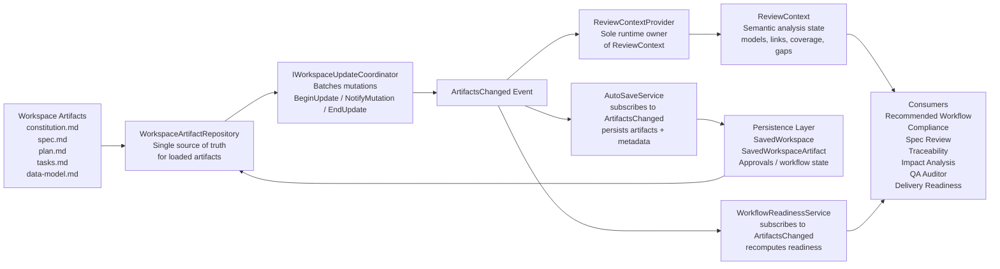
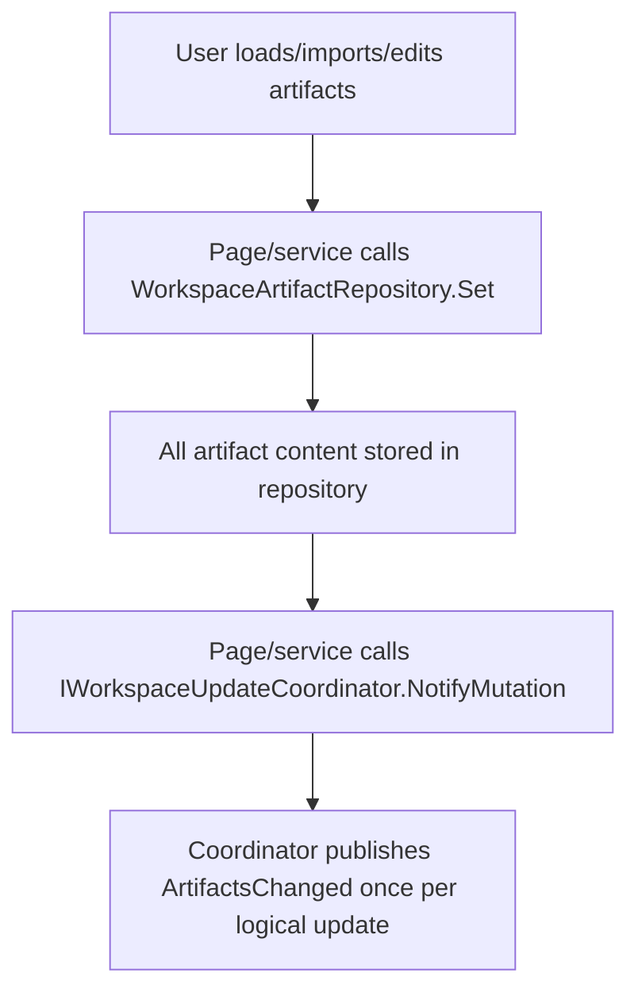
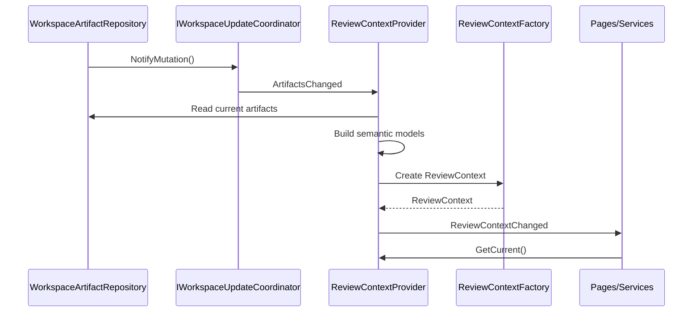
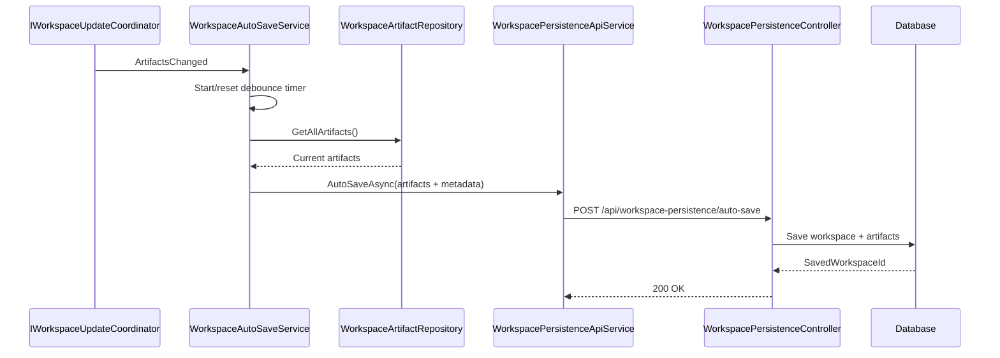
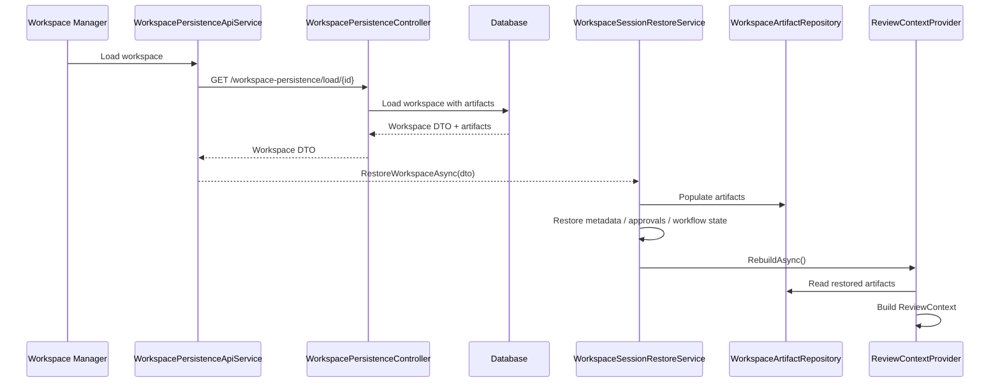
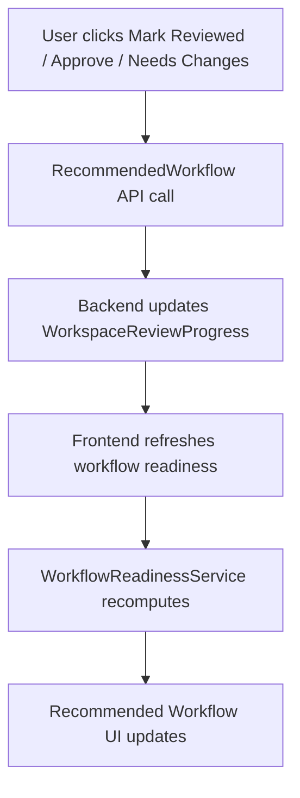
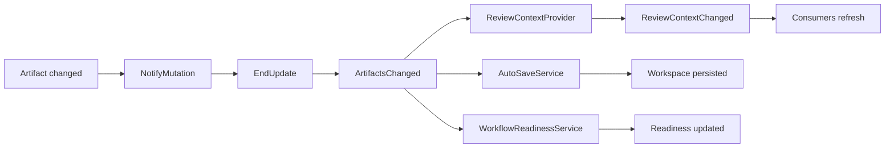

# QA Review Studio – Architecture and Runtime Flow

## Purpose

QA Review Studio is an event-driven semantic workspace. Markdown artifacts are loaded into one workspace repository, workspace changes are batched through a coordinator, ReviewContext is rebuilt as derived runtime state, and pages/services consume the latest context read-only.

---

## High-Level Architecture



---

## Core Ownership Rules

| Component | Owns | Does Not Own |
|---|---|---|
| `WorkspaceArtifactRepository` | Current in-memory workspace artifacts | Events, batching, ReviewContext, approvals |
| `IWorkspaceUpdateCoordinator` | Batched workspace mutation events | Artifact storage, persistence, approval state |
| `ReviewContextProvider` | Current runtime `ReviewContext` | Raw artifacts, workflow approvals, persistence |
| `ReviewContextFactory` | Creating `ReviewContext` from semantic models | Runtime lifecycle |
| `AutoSaveService` | Debounced persistence trigger | Artifact ownership, ReviewContext ownership |
| `WorkflowReadinessService` | Readiness calculation and workflow status | Artifact persistence, ReviewContext creation |
| Approval services/API | Reviewed/Approved/Needs Changes state | ReviewContext, artifact content |
| Consumers/pages | Read current state and display results | Rebuilding ReviewContext or reparsing markdown |

---

## Artifact Flow



For multi-artifact operations:

```csharp
Updates.BeginUpdate();
try
{
    Repository.Set(Constitution, content);
    Repository.Set(Specification, content);
    Repository.Set(Plan, content);
    Repository.Set(Tasks, content);
    Repository.Set(DataModel, content);

    Updates.NotifyMutation();
}
finally
{
    Updates.EndUpdate();
}
```

Expected result: **one logical workspace update = one `ArtifactsChanged` event**.

---

## ReviewContext Lifecycle



`ReviewContextProvider` is the **only runtime owner** of ReviewContext.

Consumers must use:

```csharp
var context = ReviewContextProvider.GetCurrent();
```

Consumers must not:

```csharp
ReviewContextFactory.Create(...);
BuildSemanticModel(...);
ParseMarkdown(...);
```

except in tests, isolated offline utilities, or intentionally standalone analysis tools.

---

## Auto-Save Flow



Important rule: AutoSave must include artifacts in the request body, using the same pattern as Save As.

---

## Restore Flow



ReviewContext must be rebuilt **after** artifacts are restored, never before.

---

## Approval and Readiness Flow



Approval state is separate from ReviewContext.

ReviewContext answers: **What does the artifact content mean?**

Approval state answers: **What did the user approve in this workspace?**

---

## Runtime Event Flow Summary



---

## Current Completed Architecture

- Workspace persistence works.
- AutoSave persists workspace with artifacts.
- Workspace Manager shows correct artifact count.
- Approve / Mark Reviewed / Needs Changes work.
- Workflow readiness updates.
- ReviewContext contract tests pass.
- ReviewContext lifecycle integration is complete.
- ReviewContextProvider is the sole runtime owner.
- Consumers are migrated or intentionally left as isolated analysis utilities.

---

## Architectural Guarantees

1. Markdown artifacts are the source input.
2. `WorkspaceArtifactRepository` is the single runtime artifact store.
3. `IWorkspaceUpdateCoordinator` emits one event per logical workspace update.
4. `ReviewContextProvider` owns runtime ReviewContext.
5. Consumers read ReviewContext; they do not build it.
6. AutoSave and approvals are event-driven and decoupled.
7. Persistence and restore preserve artifacts and approval state.
8. ReviewContext is derived state and can always be rebuilt from artifacts.

---

## Remaining Stabilization Items

- Remove temporary diagnostic logs.
- Verify no duplicate artifact/status caches remain.
- Fix remaining `spec.md` and `data-model.md` HTTP 400 issues if still present.
- Add final architecture audit documentation.
- Add end-to-end regression tests for:
  - Load sample project
  - Auto-save
  - Open workspace
  - Approve / review
  - Readiness update
  - ReviewContext rebuild

